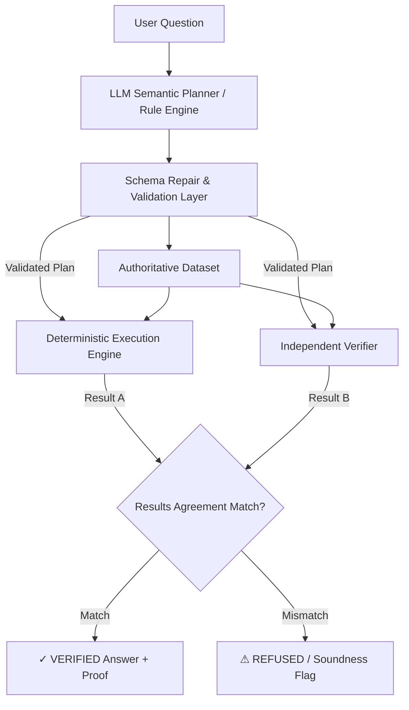

# 🛡️ Proof-Carrying Data Analyst

A self-verifying, proof-carrying data analysis engine with dual-engine mathematical verification, natural language query understanding, and an interactive web interface.

---

## 🌟 Overview

Large Language Models (LLMs) often hallucinate numbers or generate flawed SQL/Python aggregations. The **Proof-Carrying Data Analyst** solves this by enforcing **dual-engine execution with mathematical soundness proofs**:

1. **Semantic Planning**: The LLM parses natural language questions into a structured JSON execution plan (e.g. operations, metrics, comparison targets).
2. **Schema Repair & Validation**: The plan is checked and repaired against the authoritative dataset schema to eliminate hallucinations and invalid filters.
3. **Deterministic Execution**: The validated plan executes deterministically on the authoritative dataset.
4. **Independent Verification**: An independent verifier recalculates the answer on deduplicated data using a separate algorithmic path.
5. **Cryptographic / Soundness Proof**: Both engine outputs are compared. If and only if both agree 100%, the answer is delivered with a **`VERIFIED`** status. If they disagree, the query is **`REFUSED`**.



---

## ✨ Features

- **Dual-Engine Soundness**: Every answer is verified by two independent calculation engines before being shown to the user.
- **Accurate Comparison Analytics**: Supports entity-to-entity comparisons, difference calculations, and relative statements (*"How much more did Wheat make than Rice?"*, *"What is the difference between Apple and Banana sales?"*, *"Compare Rice and Wheat"*).
- **Entity Position Ordering**: Comparison targets are ordered strictly by their occurrence in the query, guaranteeing consistent deltas.
- **Automatic Metric & Dataset Selection**: Intelligently identifies the correct dataset (`sales`, `customers`, or custom CSV) and metric using semantic keyword scoring and schema inspection.
- **Interactive Web UI**: Built with Streamlit, featuring dark glassmorphic styling, side-by-side comparison breakdown cards, bar charts, and a cryptographic audit inspector.
- **Dataset Explorer**: Inspect uploaded and bundled datasets with column statistics, data types, and row previews.
- **Built-in Automated Test Suite**: Run self-tests covering comparisons, rankings, aggregates, and summaries with live pass/fail indicators.

---

## 📂 Project Structure

```text
ProofDataAnalyst/
├── app.py                  # Streamlit Web UI application
├── run_ui.py               # Launcher script for the Web UI
├── analyzer.py             # CLI entry point (re-exports dynamic_analyzer)
├── dynamic_analyzer.py     # Core engine (Planning, Execution, Verification)
├── llm_analyzer.py         # Optional modular analyzer interface
├── llm_parser.py           # LLM parser and cleaner utilities
├── requirements.txt        # Python dependencies
├── data/                   # Bundled CSV datasets
│   ├── sales.csv           # Product sales, categories, units
│   └── customers.csv       # Customer IDs, names, and regions
└── README.md               # Documentation
```

---

## 🚀 Quick Start

### 1. Prerequisites
- Python 3.10+
- (Optional) [Ollama](https://ollama.ai) with `llama3.2:3b` for local LLM planning:
  ```powershell
  ollama run llama3.2:3b
  ```
  *(If Ollama is not installed, the engine automatically falls back to its deterministic rule-based planner).*

### 2. Installation

Clone the repository and set up a Python virtual environment:

```powershell
# Create and activate virtual environment
python -m venv .venv
.venv\Scripts\activate

# Install dependencies
pip install -r requirements.txt
```

### 3. Launching the Web UI

Run the interface with either command:

```powershell
python run_ui.py
# or
streamlit run app.py
```

Open your browser at **`http://localhost:8501`**.

---

## 💻 CLI Usage

You can run the engine directly from the command line:

```powershell
# Interactive CLI / Demo queries
python analyzer.py
```

### Programmatic Python API

```python
import analyzer

# Query the engine programmatically
result = analyzer.analyze_query("What is the difference between Apple and Banana sales?")

print("Status:  ", result["status"])     # "VERIFIED"
print("Answer:  ", result["answer"])     # "Apple has 8,000 Sales and Banana has 6,000 Sales. The difference is 2,000."
print("Proof:   ", result["proof"])      # "Deterministic execution and independent verification agree."
print("Details: ", result["result"])     # {'first': 8000.0, 'second': 6000.0, 'difference': 2000.0}
```

---

## 🔍 Supported Operations

| Operation | Description | Example Queries |
| :--- | :--- | :--- |
| **`difference`** | Side-by-side comparison of two entities with net difference. | *"What is the difference between Apple and Banana sales?"*<br>*"How much more did Wheat make than Rice?"*<br>*"Compare Rice and Wheat."* |
| **`top_n`** | Grouped aggregation and ranking with direction (`asc` / `desc`). | *"Which product has the highest sales?"*<br>*"Which product sold the most units?"*<br>*"What are the top 3 products by sales?"* |
| **`aggregate`** | Numeric metric aggregations (`sum`, `mean`, `min`, `max`). | *"What is the total sales?"*<br>*"What is the average sales?"*<br>*"What is the lowest sales?"* |
| **`count`** | Row count or distinct category counts. | *"How many products are there?"*<br>*"How many categories are there?"* |
| **`row_lookup`** | Lookup matching rows based on filters or ID. | *"Show details for customer C001."*<br>*"Show all grain products."* |
| **`summary`** | Dataset metadata, total rows, columns, and missing values. | *"How many rows are in the sales data?"*<br>*"Are there missing values?"* |

---

## 🧪 Self-Test Suite

The repository includes an automated verification suite testing all query classes:

### Run via Web UI
Open the **Self-Test Suite** tab in the Web UI and click **▶ Run Test Suite**.

### Run via Command Line
```powershell
python -c "import dynamic_analyzer as da; da.run_tests(da.load_datasets())"
```

---

## 🛡️ Mathematical Soundness Guarantee

The core principle of this analyst is **Zero Hallucination Tolerance**:
- All calculations are performed deterministically in Python/Pandas over the real dataset.
- The LLM **never calculates numbers directly**; it is solely responsible for semantic intent translation into JSON plans.
- Discrepancies between execution plans and independent verification automatically trigger a **`REFUSED`** state rather than returning unverified approximations.
